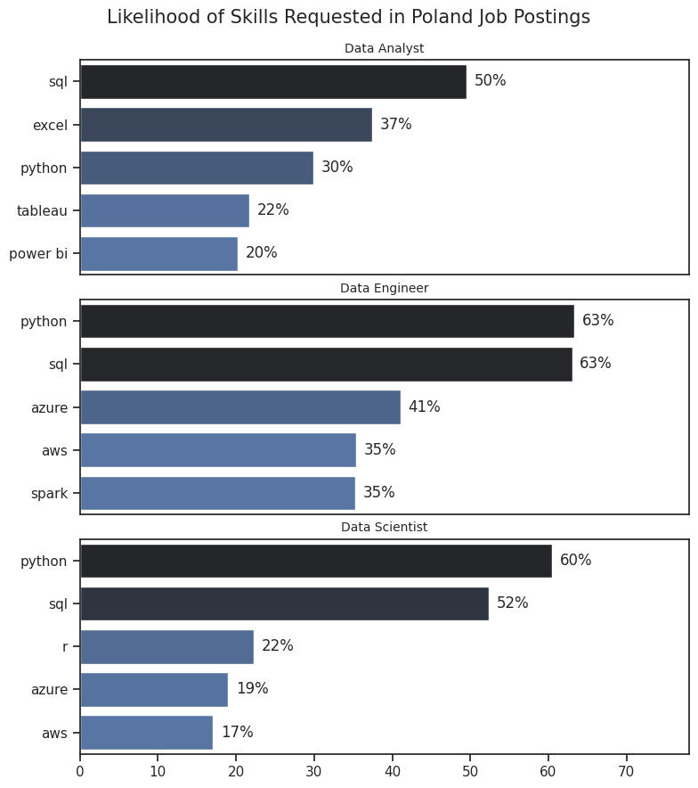

# The analysis

## 1. What are the most demanded skills for the top 3 most popular data roles?

To find the most demanded skills for the top 3 most popular data roles. I filtered out those positions by which ones were the most popular, and got the top 5 skills for these top 3 roles.
This query highlights the most popular job titles and their top skills,showing which skills i should pay attention to depending on the role I'm targeting.

View my notebook with detailed steps here: [Skill_Demand.ipynb](Skill_Demand.ipynb)

### Visualize Data

```python fig, ax = plt.subplots(len(job_titles), 1, figsize=(8, len(job_titles) * 3))  
sns.set_theme(style='ticks')

for i, job_title in enumerate(job_titles):
    # Filter and get top 5 rows
    df_plot = df_skills_perc[df_skills_perc['job_title_short'] == job_title].head(5)
    
    # Pass the actual DataFrame to sns.barplot
    sns.barplot(data=df_plot, x='skill_percent', y='job_skills', ax=ax[i], hue='skill_count', palette='dark:b_r')
    
    ax[i].set_title(job_title, fontsize=10)
    ax[i].set_ylabel('')
    ax[i].set_xlabel('')
    
    ax[i].get_legend().remove()
    
    ax[i].set_xlim(0, 78)
    
    for n, v in enumerate(df_plot['skill_percent']):
        ax[i].text(v + 1, n, f'{v:.0f}%', va='center')  
        if i !=len(job_titles)-1:
            ax[i].set_xticks([])

        


fig.suptitle('Likelihood of Skills Requested in Poland Job Postings', fontsize=15)
fig.tight_layout(h_pad=0.5)
plt.show()
```

### Results:




## Insights on Skills for Data Roles in Poland Job Postings:

SQL is a foundational skill across all roles, essential for data manipulation, querying, and database management in both Data Analysts and Data Engineers. It's also significant for Data Scientists in data extraction and processing.
Python is central for Data Engineers and Data Scientists, supporting automation, data pipelines, and machine learning. It also plays a key role for Data Analysts in advanced analytics.
Cloud Technologies, particularly Azure and AWS, are crucial for Data Engineers, with Azure being more prominent in cloud infrastructure management and AWS supporting cloud-based data processing.
R is mainly used in Data Science for statistical analysis and modeling, while less critical in the other roles.
Data Visualization Tools like Tableau and Power BI are integral for Data Analysts in creating reports and dashboards, with limited use in Data Engineering and Data Science.
Spark is important in Data Engineering for processing large datasets and working with big data frameworks.
